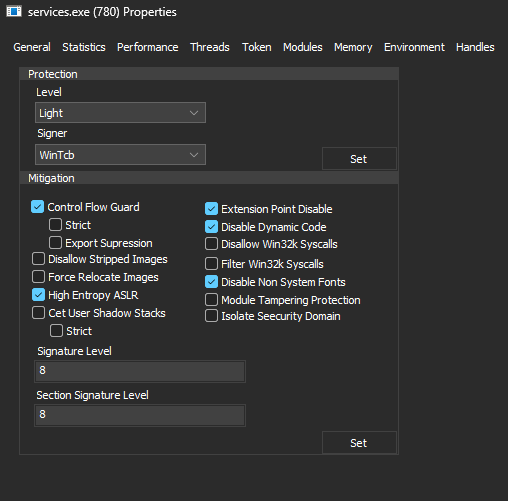

# System Extender
Kernel-supported System Informer plugin that adds cool features.

## Features
- Always use kernel handles (to open process and threads)
- Set process protection (Protected, Protected Light, None)
- Set process mitigations found in MitigationFlags and MitigationFlags2
- Set section and image signature level ([See MSDN article](https://learn.microsoft.com/en-us/windows/win32/api/winnt/ns-winnt-process_mitigation_binary_signature_policy))
- Only allows processes named as "SystemInformer.exe" to open the driver handle.

## Limitations
- Disable driver signature enforcement.
- Extra one more driver on your system.
- You need to build System Informer and set "EnableDefaultSafePlugins" to 0 from Advanced section. Beecause seems like System Informer doesn't like unsigned plugins.

## Show me how it looks
Click on any process, go to Properties, go to Extended tab.

## Why?
As good as System Informer is, it lacks certain functionality when it comes to managing processes. Sure, you can view them all and else but its a problem when the process is protected, or its like a very critical system process System Informer just can't open query handles for.

I made this a System Informer plugin, because simply:
- System Informer is amazing. It would be lame to fire up another tool just to change process protection and mitigations
- There is not much open-source plugins for System Informer.

System Extender, as its name suggests, fixes those problems by employing its own kernel driver and a few tricks up its sleeve.

## How?
### Always use kernel handles
We hook NtOpenProcess and NtOpenThread with MinHook and redirect them to our ioctl function. Our drivers return us a handle (noting its OBJECT_ATTRIBUTES structure does not have the OBJ_KERNEL_HANDLE attribute, so it can be accesseed by System Informer process) that the System Informer uses.

### Set process protection / mitigations
Undocumented Nt stuff. You can find and change offsets for other versions of Windows. Current offsets are for Windows 11 24H2.

## Problems?
Open an issue or contact me from Telegram. t.me/dev_vlltx

## Disclaimer
I am not an UI dev, especially not a dialog developer. My UI is bad, but it does its job.

THIS SOFTWARE IS PROVIDED "AS IS" WITHOUT ANY WARRANTY. DEVELOPER IS NOT RESPONSIBLE OR ANY DAMAGE OR HARM OCCURED BY USAGE OF THIS SOFTWARE.

## Credits
MinHook - Hooking library.
SystemInformer - SDK
